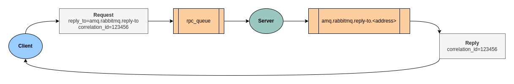

# Go Request-Reply Pattern
Ketika dua aplikasi berkomunikasi melalui sistem perpesanan (messaging), komunikasi biasanya bersifat satu arah. Namun, ada kalanya aplikasi membutuhkan komunikasi dua arah. Bagaimana cara mencapainya?

Untuk mencapainya, kita dapat menerapkan pola Request-Reply, di mana klien mengirimkan permintaan ke antrian server, dan server akan menerima permintaan dari antrian tersebut, memprosesnya, lalu mengirimkan balasan ke klien.

Penjelasan ini mungkin masih terlalu luas, jadi mari kita uraikan lebih detail dengan contoh kasus dan penerapannya menggunakan Go dan RabbitMQ.

## Background
Ketika kita membutuhkan perhitungan yang kompleks atau proses yang memakan waktu atau sumber daya, kita biasanya memutuskan untuk membuatnya secara asynchronous, di mana klien secara berkala memeriksa status atau menunggu callback saat proses selesai. Namun, bagaimana jika kita diharuskan mendapatkan respons secara langsung pada saat itu juga?

Mungkin kita akan mempertimbangkan untuk menambahkan REST API atau gRPC agar dapat merespons permintaan secara langsung. Namun, pendekatan ini akan membuka dua jalur proses dalam layanan: sebagai **Consumer** dan sebagai **Server** REST API atau gRPC. Hal ini sering kali ditentang karena dianggap melanggar arsitektur sistem yang telah dirancang sebelumnya serta menambah ketergantungan baru.

## RabbitMQ: Direct Reply-to
Direct Reply-to adalah salah satu fitur di RabbitMQ yang memungkinkan client mengirimkan permintaan ke queue server. Server kemudian akan mengonsumsi permintaan dari queue tersebut dan mengirimkan balasan ke setiap client menggunakan queue yang telah ditentukan dalam header `reply_to`.



Proses kita akan berjalan seperti ini:
1. Client membuat channel baru, dan consume pesan dari pseudo-queue `amq.rabbitmq.reply-to` dengan mode auto-acknowledgement.
2. Client mempublikasikan pesan ke `rpc_queue` dengan menambahkan header sebagai berikut:
    - Header `reply_to` dengan nilai `amq.rabbitmq.reply-to`.
    - Header `correlation_id` dengan nilai unique per masing-masing permintaan.
3. Server akan menunggu permintaan melalui `rpc_queue` (as consumer), dan ketika permintaan diterima serta selesai diproses, balasan akan dikirimkan kembali ke queue yang ditentukan pada header `reply_to`, dengan menyertakan kembali `correlation_id` yang sama.
4. Client akan menunggu respon melalui pseudo-queue. Ketika pesan diterima, client dapat melanjutkan ke proses berikutnya dan menutup channel jika tidak digunakan lagi.

## Limitations
- Client harus mengonsumsi pseudo-queue dalam mode auto-acknowledgement, yang berarti tidak dapat menolak pesan.
- Client yang menunggu balasan (consume pseudo-queue) harus menggunakan saluran (channel) yang sama dengan proses pengiriman pesan permintaan.
- Pesan yang dikirimkan melalui pseudo-queue tidak toleran terhadap kesalahan, sehingga pesan akan dibuang jika client yang menerbitkan pesan terputus.

## Simulation
Untuk mensimulasikan penjelasan di atas, Anda dapat menjalankan app pada repository ini dengan persyaratan berikut:

- Golang versi 1.22.2 atau lebih baru.
- RabbitMQ versi 3.13.7 atau lebih baru.

Sebelum menjalankan app, Anda harus membuat file konfigurasi `.env`. File ini dapat dibuat dengan menyalin file contoh yang tersedia di `.env.example`, lalu menyesuaikannya dengan konfigurasi lingkungan Anda.

Menjalankan client sebagai HTTP server
```bash
go run . client
```

cURL untuk request publish message
```bash
curl --location 'http://localhost:8000/publish' --header 'Content-Type: application/json' --data '{"message": "Test"}'
```

Menjalankan server sebagai consumer
```bash
go run . server
```

## References
Dokumentasi ini dirancang untuk merangkum sebagian kecil dari informasi yang tersedia. Penjelasan lebih detail dapat Anda temukan pada artikel berikut: 
- [RabbitMQ (Docs): Direct Reply-to](https://www.rabbitmq.com/docs/direct-reply-to)
- [RabbitMQ (Docs): Tutorial Six Go](https://www.rabbitmq.com/tutorials/tutorial-six-go)
- [Messaging Pattern](https://www.enterpriseintegrationpatterns.com/patterns/messaging/RequestReply.html)
